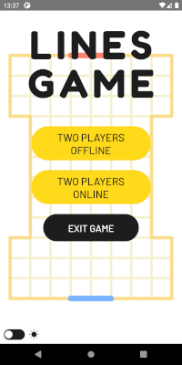
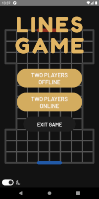

# Lines

> Turn-based Android and iOS game

# Features

- PvP on the same device or online (one player sends link, the other handles it via Deep Linking)
- random map generation in three sizes
- optional dark mode

# Stack

- React Native + Redux
- Firestore + RTDB (online functionalities)
- GreenSock + Animated API

# Showcase

## Start menu

&nbsp;&nbsp;&nbsp;&nbsp;

## In-game

&nbsp;&nbsp;&nbsp;&nbsp;

## Map generation

&nbsp;&nbsp;&nbsp;&nbsp;

